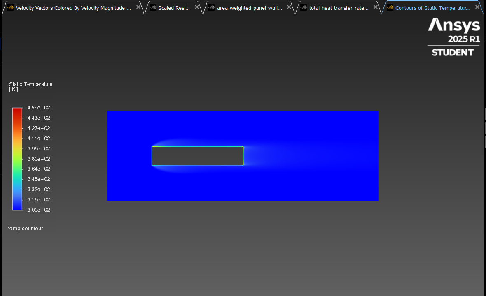
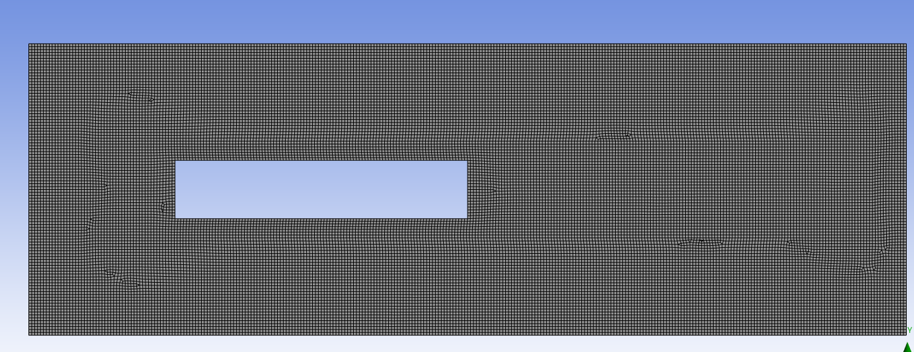
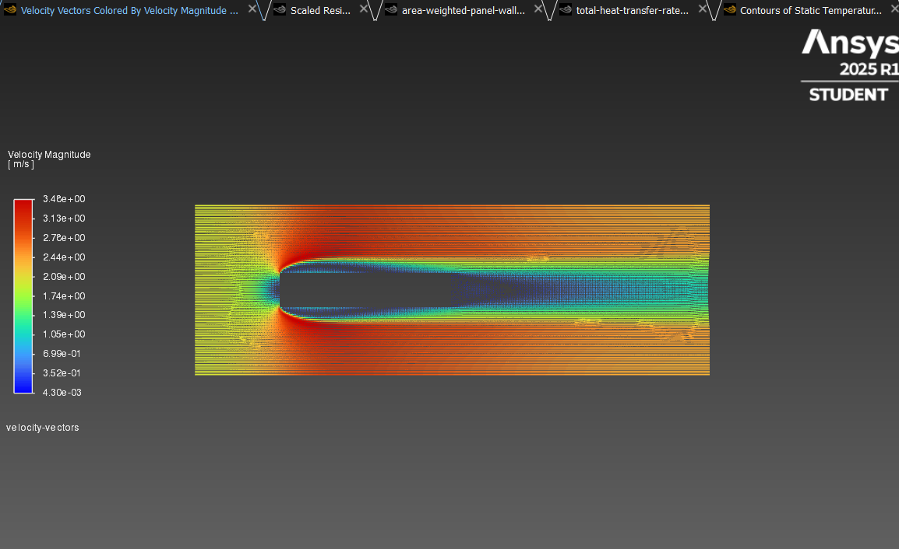
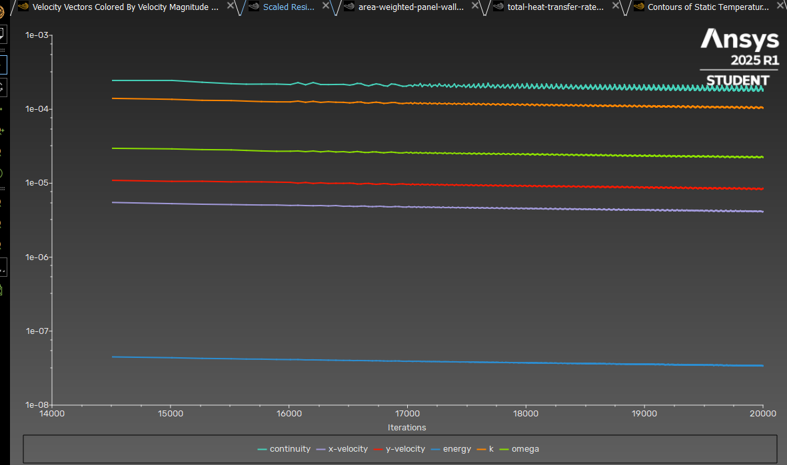
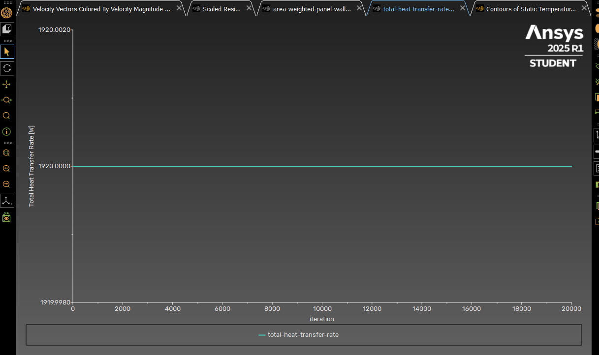
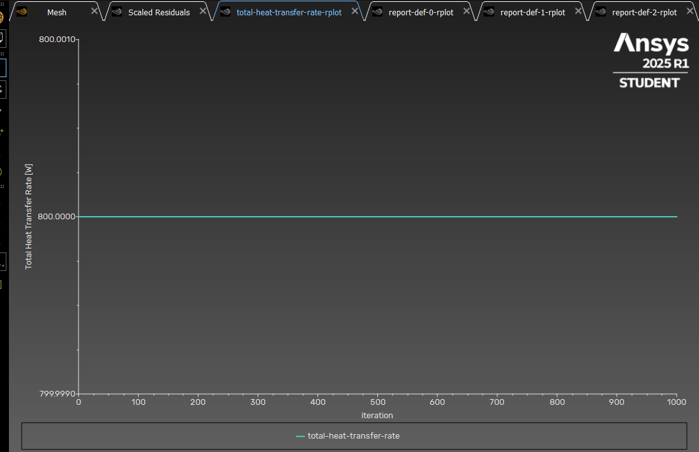
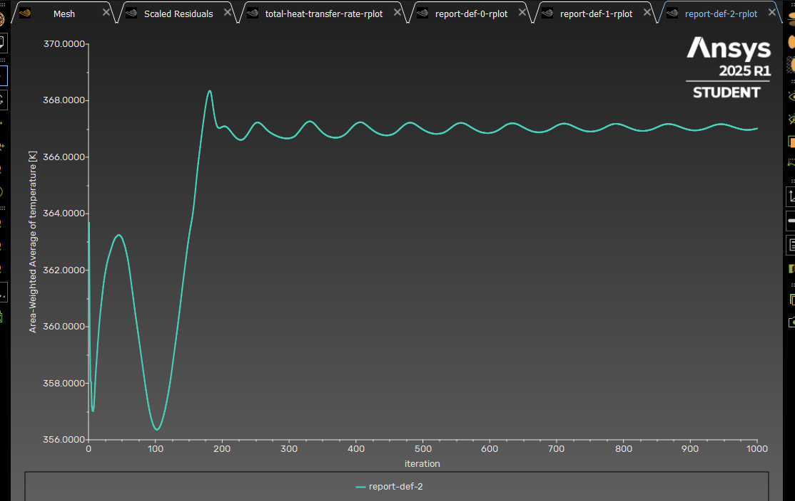

# 📌 CFD Project: PV Panel Cooling with Air Flow (2D - Steady)



This project is a **CFD + Thermal analysis** study modeling the cooling of a 2D photovoltaic (PV) panel with natural external air flow. It was conducted as part of the preparation for the **Smart Renewable Energy Engineering** master's program at Gdansk University of Technology.

## 🎯 Objectives

- Model the heat input equivalent to constant solar radiation on the PV panel (800 W/m²)
- Analyze how effectively the air flow cools the panel
- Obtain outputs such as `Total Heat Transfer`, `Panel Surface Temperature`, and `Velocity Field`
- Calculate and compare results with MATLAB and CFD

---

## ⚙️ Simulation Details



- **Software**: ANSYS Fluent R1 2025 (Student Version)
- **Geometry**: 2D, rectangular PV panel (1m × 0.2m)
- **Mesh**: 60,000+ elements, refined in critical regions
- **Flow Type**: Incompressible, Steady-State, **Turbulent (SST k-ω)**
- **Initial Model**: Laminar; switched to SST k-omega due to solution instability
- **Panel Definition**: Solid body, heat flux applied to outer surfaces to simulate heat input

---

## 🧪 Boundary Conditions

| Surface         | Definition                   |
|-----------------|------------------------------|
| Inlet           | Velocity Inlet (2 m/s, 300 K) |
| Outlet          | Pressure Outlet (0 Pa)       |
| Panel Perimeter (4 edges) | Heat Flux: 800 W/m² |
| Other Walls     | Symmetry or adiabatic        |

**Total surface area** (panel perimeter):  
\[
A = 2 \times 1.0 + 2 \times 0.2 = 2.4 \, \text{m}^2
\]  
**Total heat input**:  
\[
Q_{\text{input}} = 800 \times 2.4 = 1920 \, \text{W}
\]

---

## 📈 Results Visualization

### Temperature Distribution


### Air Flow Patterns


### Convergence Monitoring


---

## 📊 Key Results

- **Average panel temperature**: 374.60 K
- **Total Heat Transfer Rate** (Fluent): 1920 W
- **Inlet air temperature**: 300 K
- **Heat transfer coefficient (h)**: 26.60 W/m²·K (calculated with MATLAB)




## Revision Notes for Heat Flux Implementation

### Issue Identified
In my previous simulation, I applied a heat flux of 800 W/m² uniformly across **four surfaces**.  
This configuration is **physically unrealistic** for solar panels, as incident heat flux only originates from the **top surface** in real-world scenarios.

### Impact & Corrections
While the model remains **mathematically valid**, the unphysical setup affected key results.  
To resolve this, I've updated:
1. **Total Heat Transfer Rate** graph  
2. **Area-Weighted Static Temperature** distributions  

### Visual Documentation
  
  

### Key Technical Takeaways
- **Physical vs. Mathematical Validity**: Aligning boundary conditions with real-world constraints is critical.  
- **Data Transparency**: Revisions documented with standardized graphs for reproducibility.  

---


---

## 📉 MATLAB Code Analysis

The complete MATLAB analysis script is available here:  
[Matlab_Analysis.m](Matlab_Analysis.m)

```matlab
% Input Data
q_flux = 800;                   % W/m²
total_surface_area = 2.4;       % m²
Q_input = q_flux * total_surface_area;   % W

Q_removed = 1920;               % W
T_panel = 374.60;               % K
T_inlet = 300.00;               % K

% Efficiency
eta = Q_removed / Q_input;

% Heat Transfer Coefficient
delta_T = T_panel - T_inlet;
h = Q_removed / (total_surface_area * delta_T);

% Outputs
fprintf('--- CFD Heat Transfer Results ---\n');
fprintf('Q_input: %.2f W\n', Q_input);
fprintf('Q_removed: %.2f W\n', Q_removed);
fprintf('Efficiency: %.2f%%\n', eta * 100);
fprintf('Heat Transfer Coefficient h: %.2f W/m²K\n', h);
```

---

✉️ **Contact**: [Burak Yorukcu](mailto:burakyorukcu@outlook.com)  
🔗 **Project Owner**: [@burakyorukcu](mailto:burakyorukcu@outlook.com) 


